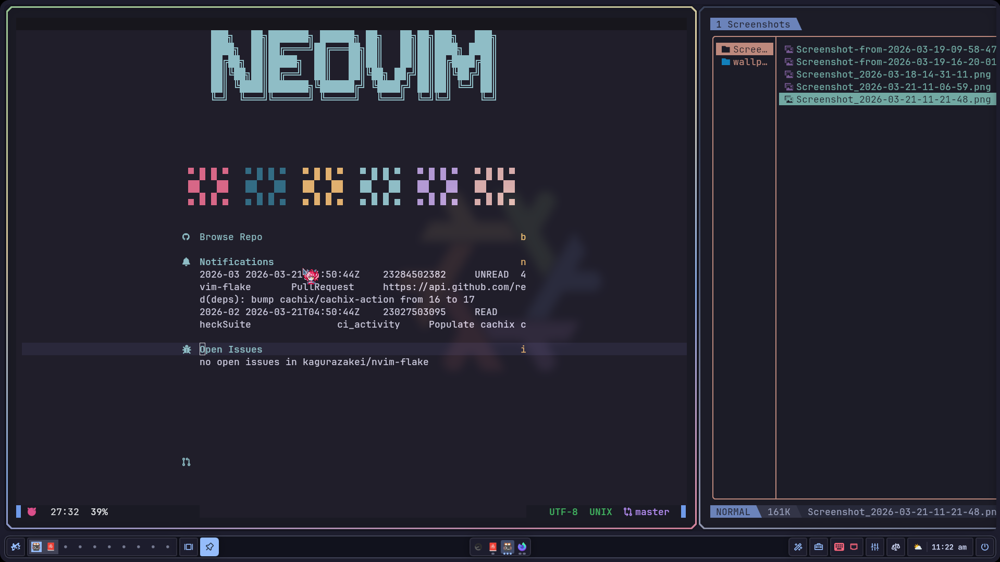
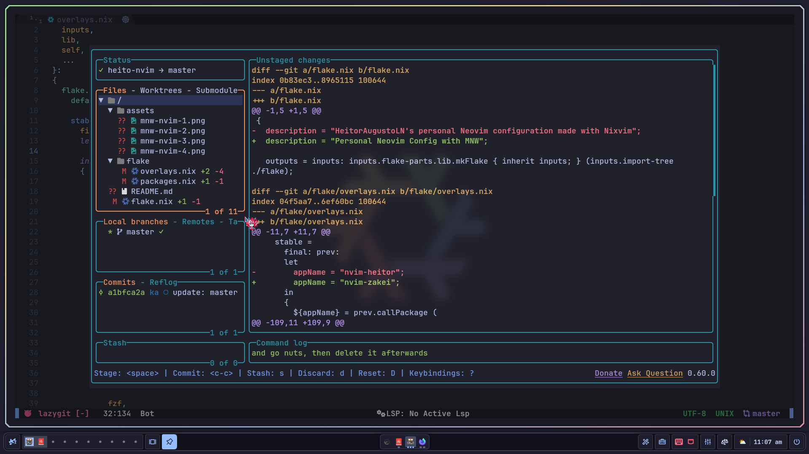
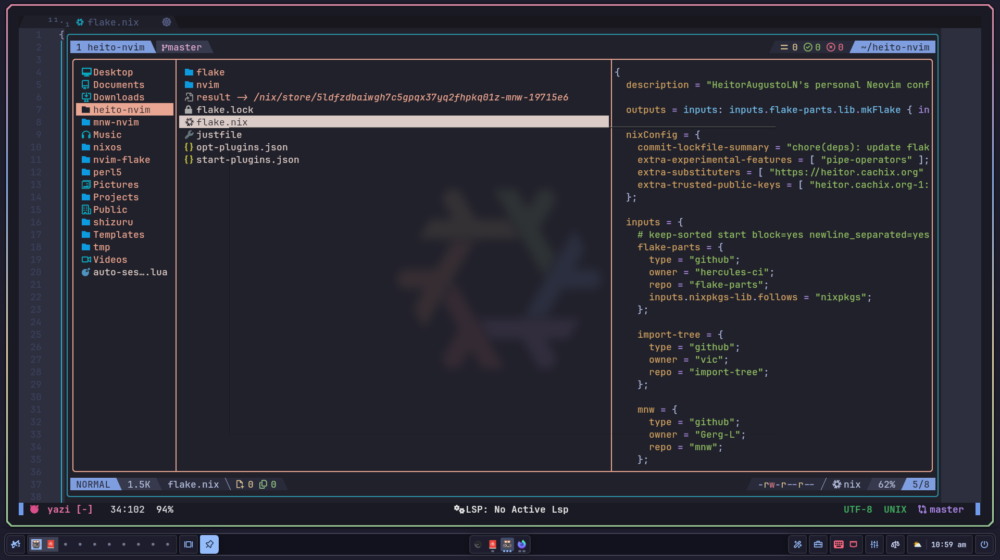
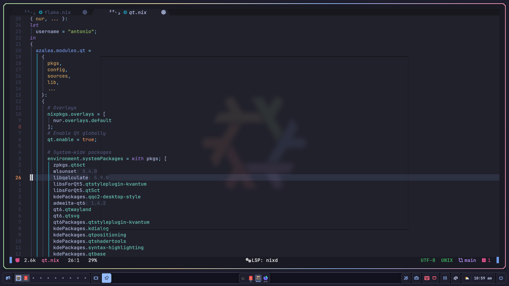

# NeoVim Flake
neovim config from scratch Using MNW [Minimal NeoVim Wrapper](https://github.com/Gerg-L/mnw)
> [!WARNING]





### 💤 using lz.n as Lazy loading plugins

# 📦 Install
- This is not meant to be used without nix, but I am pretty sure it works ok.

## Flakes
Add this flake as an input
```nix
#flake.nix
{
  inputs = {
    nvim-flake = {
      url = "github:kagurazakei/nvim-flake";
      inputs.nixpkgs.follows = "nixpkgs";
    };
    neovim-nightly = {
      url = "github:nix-community/neovim-nightly";
      inputs.nixpkgs.follows = "nixpkgs";
    };
...
```
(Make sure you're passing inputs to your [modules](https://blog.nobbz.dev/blog/2022-12-12-getting-inputs-to-modules-in-a-flake/))
### (or) If you want to use via npins
```npins add github kagurazakei nvim-flake -b main```

### Add to user environment
```nix
# add system wide
{
  pkgs,
  sources,
  inputs,
}: {
  environment.systemPackages = [
    inputs.nvim-flake.packages.${pkgs.stdenv.system}.neovim
      (pkgs.callPackage "${sources.nvim-flake}/default.nix" {
        inherit mnw pkgs;
        neovim-nightly = inputs.neovim-nightly;
        lib = pkgs.lib;
        dev = false;
      })
  ];

# add per-user
  users.users."<name>".packages = [
    inputs.nvim-flake.packages.${pkgs.stdenv.system}.neovim
      (pkgs.callPackage "${sources.nvim-flake}/default.nix" {
        inherit mnw pkgs;
        neovim-nightly = inputs.neovim-nightly;
        lib = pkgs.lib;
        dev = false;
      })
];
}
```
### dont forget to add specialargs to neovim-nightly it will cause build fail

# Forking usage guide

Update the flake like any other `nix flake update`

Add/remove/update plugins via [npins](https://github.com/andir/npins) ( aliased to `start` and `opt` if you're in the devShell)
Example of adding a plugin: `start add github nvim-treesitter nvim-treesitter-context --branch main`
Example of updated all plugins: `start update --full && opt update --full`w

